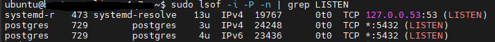
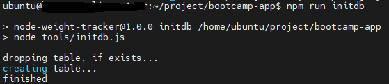
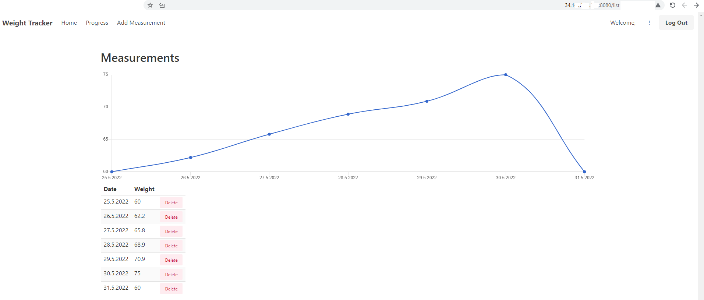

# Node.js Weight Tracker

This sample application demonstrates the following technologies.

* [hapi](https://hapi.dev) - a wonderful Node.js application framework
* [PostgreSQL](https://www.postgresql.org/) - a popular relational database
* [Postgres](https://github.com/porsager/postgres) - a new PostgreSQL client for Node.js
* [Vue.js](https://vuejs.org/) - a popular front-end library
* [Bulma](https://bulma.io/) - a great CSS framework based on Flexbox
* [EJS](https://ejs.co/) - a great template library for server-side HTML templates

# Description
This guide will show you how to deploy the  ` Node.js Weight Tracker`,
using two servers, one dedicated to the database and another dedicated to the application.

Both servers run `Ubuntu Server` operating systems.

# Requirements
- Two servers running `Ubuntu Server` operating system.
- [Node.js](https://nodejs.org/) 14.x
- [PostgreSQL](https://www.postgresql.org/)
- [Free Okta developer account](https://developer.okta.com/) for account registration, login

## Install and Configuration

1. Clone or download on both servers.
2. Install `Node.js` version 14.x and `npm` on both servers.
3. Run `npm install` to install dependencies on both servers.
4. Set up PostgreSQL - `sudo apt-get install postgresql postgresql-contrib` at the `DBServer`.
5. Open your `postgresql` port to allow traffic on port 5432.
 > 
6. Create a [free Okta developer account](https://developer.okta.com/) and add a web application for this app.
7. Create `.env` and change the `OKTA_*` & `Host` & `postgresql` configuration values to your application.
- WebServer .env -
~~~yaml
  # Host configuration
  PORT=8080
  HOST="HOST-IP"
  NODE_ENV=development
  HOST_URL=http:/"HOST-IP":8080
  COOKIE_ENCRYPT_PWD=superAwesomePasswordStringThatIsAtLeast32CharactersLong!

  # Okta configuration
  OKTA_ORG_URL="https://"OKTA_DOMAIN_URL".okta.com"
  OKTA_CLIENT_ID="CLIENT-ID-PASSWORD"
  OKTA_CLIENT_SECRET="Your-WEB-APP-INTEGRATION-SECRET"

  # Postgres configuration
  PGHOST="POSTGRESS-HOST-IP"
  PGUSERNAME="POSTGRESS USER"
  PGDATABASE="POSTGRESS DB"
  PGPASSWORD="POSTGRESS PASSWORD"
  PGPORT=5432
~~~
- DBServer .env -
~~~yaml
  # Host configuration
  NODE_ENV=development
  HOST_URL=http:/"HOST-IP":8080
  COOKIE_ENCRYPT_PWD=superAwesomePasswordStringThatIsAtLeast32CharactersLong!

  # Postgres configuration
  PGHOST="POSTGRESS-HOST-IP"
  PGUSERNAME="POSTGRESS USER"
  PGDATABASE="POSTGRESS DB"
  PGPASSWORD="POSTGRESS PASSWORD"
  PGPORT=5432
~~~

8. Initialize the PostgreSQL database by running `npm run initdb` at the `DBServer`
9. > 
10. Run `npm run dev` to start Node.js at the `WebServer`

**Note:**

`DBServer` will automatically run after reboot.

`WebServer` will automatically run after reboot if we add him to `crontab`:

- Run `crontab -e`
- Insert the follow line : `@reboot cd YOUR_PROJECT_PATH && sudo npm run dev`